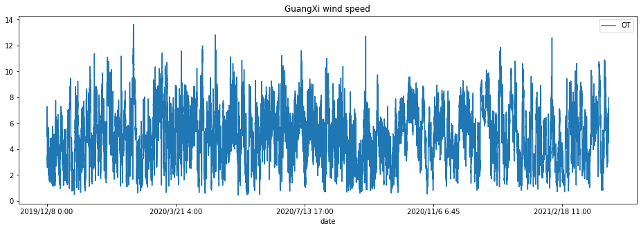
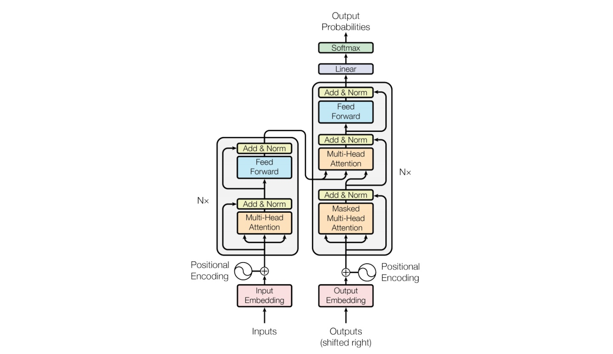
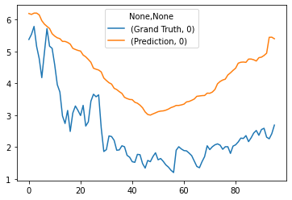
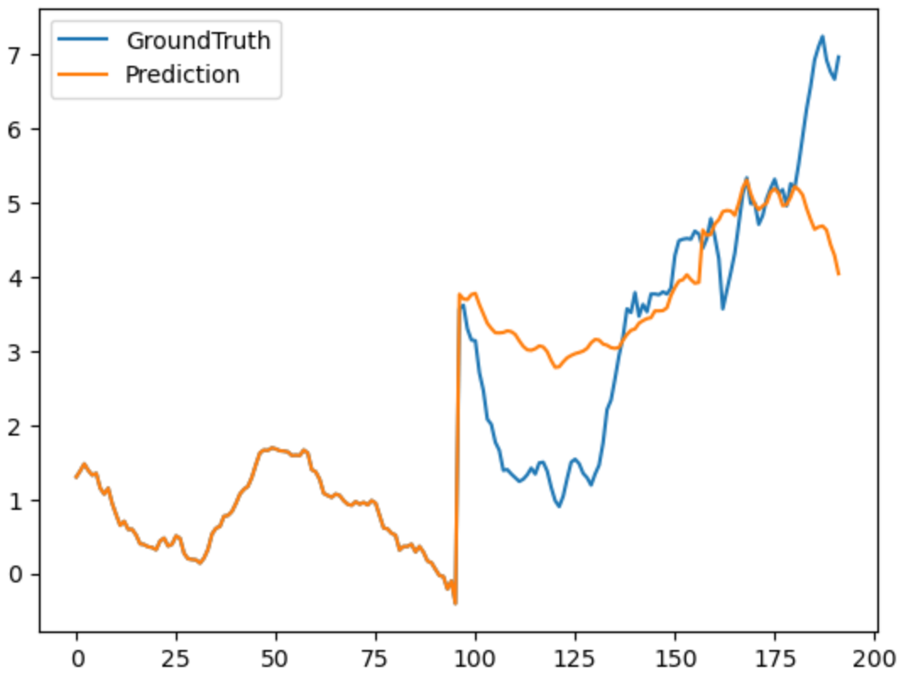

# 金风风速预测


```python
%matplotlib inline
```

### 一、业务理解

**风速预测:** 风力发电直接接入国家电网，需要准确预报发电功率以保持电压平稳、**减少能源浪费**，且预报偏差大会受到财务**处罚**


```python
from IPython.display import Image
Image(filename='/Users/yhuang/dev/anylearn-resources/jinfeng-demo/wind.jpg', width=320)
```


    

    


### 二、数据理解

1. 历史风场平均风速观测记录
    * 广西一年多的数据，数据间隔15分钟
    * 新疆四年多的数据，数据间隔15分钟
2. 风场气象数值预报
    * 广西和新疆
    * 各4份不同的气象源数据
    * 以“广西EC气象源“数据为例，共有67105行数据，每条数据共有包含时间戳的36个特征


```python
import numpy as np
import matplotlib.pyplot as plot
import pandas as pd

df = pd.read_csv("/Users/yhuang/dev/anylearn-resources/datasets/jinfeng_guangxi/wind_guangxi.csv",
                 index_col=0)
df.plot(title="GuangXi wind speed", figsize=(16, 5))
```


    <AxesSubplot:title={'center':'GuangXi wind speed'}, xlabel='date'>


    

    


### 三、数据准备

1. 数据格式处理，调整时间戳格式为标准时序算法库读入格式。创建对应csv文件。该csv文件为目前时序预测使用的主要文件。
2. 数据清洗，删去csv文件中数值为空的记录。在保证时序数据严格排列的基础上，尽量使数据等间隔排列。
3. 数据合并，将各地风速记录和气象源数据合并起来，在保证时间戳绝对一致且严格排序的基础上，尽可能保留多的等间隔数据。此外，由于同一地方4个预测的气象源数据之间存在出入，我们尝试首先将其4个预测值求平均然和与风速进行合并并生成最终的数据csv文件。（该文件目前暂未使用）

### 四、模型建立

tranformer时序预测
* 本地无封装的生算法
* 本地数据集


```python
Image(filename='/Users/yhuang/dev/anylearn-resources/jinfeng-demo/transformer.jpg') 
```


    

    


#### 1 - 初始化SDK与Anylearn后端引擎连接


```python
from anylearn.config import init_sdk
init_sdk('http://192.168.10.22:31888', 'xlearn', '123456')
```

#### 2 - 调用SDK快速训练


```python
from anylearn.applications.quickstart import quick_train
train_task = quick_train(algorithm_dir="/Users/yhuang/dev/anylearn-resources/algo/transformer",
                         dataset_dir="/Users/yhuang/dev/anylearn-resources/datasets/jinfeng_guangxi",
                         entrypoint="python -u main_informer.py",
                         output="output_model",
                         dataset_hyperparam_name="data_path",
                         hyperparams={
                            'is_training': '1',
                            'root_path': '.',
                            'data_path': 'wind_guangxi.csv',
                            'model_id': 'wind_guangxi_96',
                            'model': 'transformer',
                            'data': 'custom',
                            'features': 'M',
                            'seq_len': '336',
                            'label_len': '198',
                            'pred_len': '96',
                            'enc_in': ' 1',
                            'dec_in': ' 1',
                            'c_out': '  1',
                            'e_layers': '3',
                            'd_layers': '2',
                            'attn': 'prob',
                            'des': 'Exp',
                            'itr': '1',
                         })
train_task
```


    TrainTask(name='281a4xzf', description='', state=0, visibility=1, creator_id='USERfb6c6d2111eaadda13fd17feeac7', owner=['USERfb6c6d2111eaadda13fd17feeac7'], project_id=None, algorithm_id='ALGOa288992c11eb84a8c6ab6ee15143', train_params='{"data_path": "wind_guangxi.csv", "is_training": "1", "root_path": ".", "model_id": "wind_guangxi_96", "model": "transformer", "data": "custom", "features": "M", "seq_len": "336", "label_len": "198", "pred_len": "96", "enc_in": " 1", "dec_in": " 1", "c_out": "  1", "e_layers": "3", "d_layers": "2", "attn": "prob", "des": "Exp", "itr": "1"}', files='DSET217a992c11eb84a8c6ab6ee15143', results_id='FILEe112992c11eb84a8c6ab6ee15143', secret_key='TKEY90a6992c11eb84a8c6ab6ee15143', create_time='2021-04-09 20:09:32', finish_time='', envs='', gpu_num=1, hpo=False, hpo_search_space=None, id='TRAI12ce992c11eb84a8c6ab6ee15143')


#### 3 - 跟踪训练进度


```python
import time

status = train_task.get_status()
while 'state' not in status:
    print("Waiting...")
    time.sleep(120)
    status = train_task.get_status()
while status['state'] not in ["success", "fail"]:
    if 'process' in status:
        print(f"Progress: {int(100 * float(status['process']))}%")
    else:
        print(status['state'])
    time.sleep(300)
    status = train_task.get_status()
    print(status)
status['state']
```

    Waiting...
    working
    {'ip': '10.244.2.220', 'secret_key': 'TKEY90a6992c11eb84a8c6ab6ee15143', 'state': 'working'}
    working
    {'ip': '10.244.2.220', 'secret_key': 'TKEY90a6992c11eb84a8c6ab6ee15143', 'state': 'working'}
    working
    {'ip': '10.244.2.220', 'secret_key': 'TKEY90a6992c11eb84a8c6ab6ee15143', 'state': 'working'}
    working
    {'ip': '10.244.2.220', 'secret_key': 'TKEY90a6992c11eb84a8c6ab6ee15143', 'state': 'working'}
    working
    {'ip': '10.244.2.220', 'secret_key': 'TKEY90a6992c11eb84a8c6ab6ee15143', 'state': 'success'}


    'success'


### 五、模型验证

#### 1 - 导出训练结果


```python
train_task.get_detail()

from pathlib import Path
import shutil

from anylearn.interfaces.resource import SyncResourceDownloader

workdir = Path("/Users/yhuang/dev/anylearn-resources/models/")

downloader = SyncResourceDownloader()
res = train_task.download_results(save_path=workdir,
                                  downloader=downloader)
shutil.unpack_archive(workdir / res, workdir / train_task.id, format="zip")
```

#### 2 - 调用SDK快速验证


```python
from anylearn.applications.quickstart import quick_evaluate
eval_task = quick_evaluate(model_dir=workdir / train_task.id / "output_model",
                           algorithm_dir="/Users/yhuang/dev/anylearn-resources/algo/transformer",
                           dataset_dir="/Users/yhuang/dev/anylearn-resources/datasets/jinfeng_guangxi",
                           entrypoint="python -u main_informer.py",
                           output="results.txt",
                           model_hyperparam_name="model_path",
                           dataset_hyperparam_name="data_path",
                           hyperparams={
                               'is_training': '0',
                               'root_path': '.',
                               'data_path': 'wind_guangxi.csv',
                               'model_id': 'wind_guangxi_96',
                               'model': 'transformer',
                               'data': 'custom',
                               'features': 'M',
                               'seq_len': '336',
                               'label_len': '198',
                               'pred_len': '96',
                               'enc_in': ' 1',
                               'dec_in': ' 1',
                               'c_out': '  1',
                               'e_layers': '3',
                               'd_layers': '2',
                               'attn': 'prob',
                               'des': 'Exp',
                               'itr': '1',
                           })
eval_task
```


    EvaluateTask(id='EVAL8462993011eb84a8c6ab6ee15143', name='hc42zqrj', description='', state=0, visibility=1, creator_id='USERfb6c6d2111eaadda13fd17feeac7', owner=['USERfb6c6d2111eaadda13fd17feeac7'], create_time='2021-04-09 20:37:41', finish_time='', params_list='[{"id": null, "model_id": "MODEd638993011eb84a8c6ab6ee15143", "files": "DSETa020993011eb84a8c6ab6ee15143", "evaluate_params": {"model_path": "$MODEd638993011eb84a8c6ab6ee15143", "data_path": "wind_guangxi.csv", "is_training": "0", "root_path": ".", "model_id": "wind_guangxi_96", "model": "transformer", "data": "custom", "features": "M", "seq_len": "336", "label_len": "198", "pred_len": "96", "enc_in": " 1", "dec_in": " 1", "c_out": "  1", "e_layers": "3", "d_layers": "2", "attn": "prob", "des": "Exp", "itr": "1"}, "envs": "", "gpu_num": 1, "results": null}]', sub_tasks=[EvaluateSubTask(id='EVRE58e6993011eb84a8c6ab6ee15143', model_id='MODEd638993011eb84a8c6ab6ee15143', files=['DSETa020993011eb84a8c6ab6ee15143'], evaluate_params={'model_path': '$MODEd638993011eb84a8c6ab6ee15143', 'data_path': 'wind_guangxi.csv', 'is_training': '0', 'root_path': '.', 'model_id': 'wind_guangxi_96', 'model': 'transformer', 'data': 'custom', 'features': 'M', 'seq_len': '336', 'label_len': '198', 'pred_len': '96', 'enc_in': ' 1', 'dec_in': ' 1', 'c_out': '  1', 'e_layers': '3', 'd_layers': '2', 'attn': 'prob', 'des': 'Exp', 'itr': '1'}, envs={}, gpu_num=1, results='')], secret_key='TKEY8624993011eb84a8c6ab6ee15143')


#### 3 - 跟踪验证结果


```python
import json
import time

from anylearn.interfaces import EvaluateTaskState

while eval_task.state not in [EvaluateTaskState.SUCCESS, EvaluateTaskState.FAIL]:
    print("WORKING...")
    time.sleep(120)
    eval_task.get_detail()
res = eval_task.sub_tasks[0].results
res = json.loads(res)
f"MAE={res[0]}, MSE={res[1]}, RMSE={res[2]}, MAPE={res[3]}, MSPE={res[4]}"
```

    WORKING...


    'MAE=1.8480165935683308, MSE=5.61330767520882, RMSE=2.369242004356841, MAPE=0.48834682922383105, MSPE=0.5475133798117985'


#### 4 - 样例预测结果 (1)


```python
truth = np.load(workdir / train_task.id / "output_model/results/true.npy")
pred = np.load(workdir / train_task.id / "output_model/results/pred.npy")
df_t = pd.DataFrame(truth[0])
df_p = pd.DataFrame(pred[0])
print(df_t.shape, df_p.shape)
df = pd.concat({"Grand Truth": df_t, "Prediction": df_p}, axis=1)
df.plot()
```

    (96, 1) (96, 1)


    <AxesSubplot:>


    

    


#### 5 - 样例预测结果 (2 静态图)


```python
Image(filename='/Users/yhuang/dev/anylearn-resources/jinfeng-demo/pred2.png', width=360) 
```


    

    


### 六、模型部署

*暂未支持非标准无封装算法/模型的在线服务部署，持续设计与开发中……*
